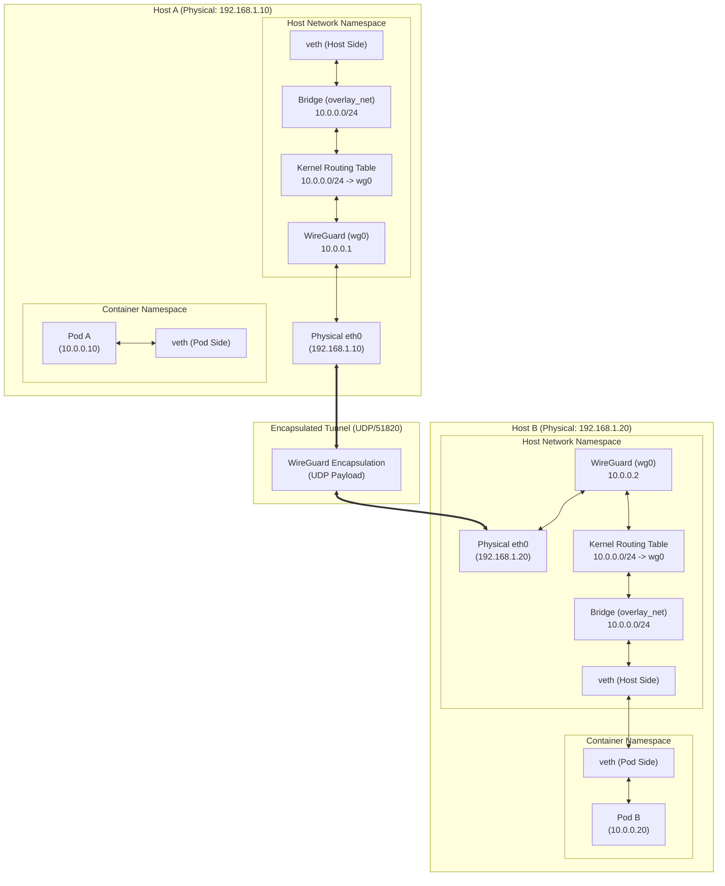
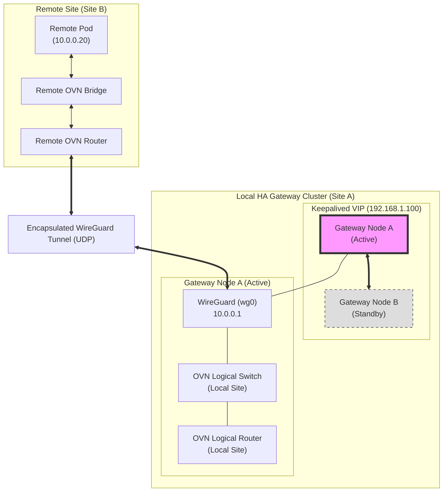

In modern distributed systems, we often face the challenge of maintaining a flat, unified network topology across physically separated infrastructure. Whether you are running edge computing nodes or multi-region clusters, the ability to have a Pod on Host A communicate with a Pod on Host B as if they were on the same local subnet is critical for service discovery and simplified application logic.

In this post, we will explore how to use WireGuard's Peer-to-lar (P2P) capabilities to establish a secure, encrypted tunnel that expands a single virtual subnet across two different physical machines.

# The Deep Dive: WireGuard as a Network Overlay

WireGuard is not just a VPN; it is a high-performance, kernel-level implementation of a Layer 3 (IP) tunnel. Unlike traditional VPN protocols that rely on complex handssakes and heavy overhead, WireGuard uses "Cryptokey Routing." Each peer is identified by its public key, and traffic is routed based on the allowed IP addresses associated with that key.

By configuring two hosts with a shared virtual subnet (e.g., `10.0.0.0/24`) and establishing a P2P tunnel between them, we create a "virtual overlay." When a packet is sent to an IP within this range, the host's routing table directs it through the `wg0` interface, which then encapsulates the packet and sends it to the peer.

The magic happens when we extend this to containers. By configuring our container runtime (like Podman or Docker) to route traffic for this specific subnet through the host's WireGuard interface, we achieve true pod-to-pod communication across physical boundaries without needing complex SDN (Software Defined Networking) controllers like BGP or VXLAN.

# The Architecture

Our setup consists of two physical hosts:

1. **Host A (The Origin)**:
   - Physical IP: `192.168.1.10`
   - WireGuard IP: `10.0.0.1`
   - Pod A IP: `10.0.0.10`

2. **Host B (The Destination)**:
   - Physical IP: `192.168.1.20`
   - WireGuard IP: `10.0.0.2`
   - Pod B IP: `10.0.0.20`



# Step-by-Step Demo

To make this setup repeatable and scalable, I have created an Ansible playbook that automates the entire process, from key generation to container network configuration.

### Automation with Ansible

The `ansible-wireguard-p2P` project provides a structured way to deploy this architecture. You can find the repository in the [ansible-wireguard-p2p](./ansible-wireguard-p2p) directory of this repo.

The project structure is as follows:
```text
ansible-wireguard-p2p/
├── inventory.ini             # List of hosts
├── group_vars/all.yml        # Common configuration
├── host_vars/                # Host-segment configuration
│   ├── host_a.yml
│   └── host_b.yml
├── templates/
│   └── wg0.conf.j2           # WireGuard configuration template
└── playbook.yml              # The main automation playbook
```

By simply updating the `host_vars` with your physical and virtual IP addresses, you can deploy the tunnel across any number of nodes.

### Manual Setup (The Hard Way)

If you prefer to do it manually, follow these steps:

#### Prerequisites

- Two Linux-based hosts with internet connectivity.
- WireGuard installed on both hosts (`sudo dnf install wireguard -y`).
- Podman or Docker installed on both hosts.
- Root or sudo access.

### Step 1: Establishing the WireGuard P2P Tunnel

First, we generate the necessary keys on both hosts.

**On Host A:**
```bash
mkdir -p ~/wg-keys
wg genkey | tee ~/wg-keys/privatekey | wg pubkey > ~/wg-keys/publickey
```

**On Host B:**
```bash
mkdir -p ~/wg-keys
wg genkey | tee ~/wg-keys/privatekey | wg pubintkey > ~/wg-keys/publickey
```

Next, we create the configuration files.

**Host A Configuration (`/etc/wireguard/wg0.conf`):**
```ini
[Interface]
PrivateKey = <Contents of Host A privatekey>
Address = 10.0.0.1/24

[Peer]
PublicKey = <Contents of Host B publickey>
Endpoint = 192.168.1.20:51820
AllowedIPs = 10.0.0.0/24
```

**Host B Configuration (`/etc/wireguard/wg0.conf`):**
```ini
[Interface]
PrivateKey = <Contents of Host B privatekey>
Address = 10.0.0.2/24

[Peer]
PublicKey = <Contents of Host A publickey>
Endpoint = 192.168.1.10:51820
AllowedIPs = 10.0.0.0/24
```

Now, bring up the interface on both hosts:
```bash
sudo wg-quick up wg0
```

Verify connectivity by pinging the peer's WireGuard IP:
```bash
ping 10.0.0.2  # From Host A
ping 10.0.0.1  # From Host B
```

### Step 2: Configuring the Container Network

Now that the hosts can talk via `10.0.0.0/24`, we need to ensure the Pods use this path. We will use Podman to create a custom network.

**On Host A:**
We create a network that is aware of our virtual subnet.
```bash
podman network create --subnet 10.0.0.0/24 overlay_net
```

Launch Pod A with a static IP within our virtual range:
```bash
podman run -d --name pod-a --network overlay_net --ip 10.0.0.10 alpine sleep infinity
```

**On Host B:**
Similarly, create the network and launch Pod B.
```bash
podman network create --subnet 10.0.0.0/24 overlay_net
```

Launch Pod B:
```bash
podman run -d --name pod-b --network overlay_net --ip 10.0.0.20 alpine sleep infinity
```

*Note: In a production scenario, you would ensure the host's routing table directs traffic for `10.0.0.0/24` via `wg0` so that the container engine's bridge can reach the remote peer.*

### Step 3: Verification

Finally, let's test the end-toed connectivity between the two pods.

**From Pod A to Pod B:**
```bash
podman exec pod-a ping -c 4 10.0.0.20
```

**From Pod B to Pod A:**
```bash
podman exec pod-b ping -c 4 10.0.0.10
```

If you see successful replies, you have successfully expanded your virtual subnet across two physical machines using a WireGuard P2P tunnel!

# High Availability (HA) and Scaling

While the P2P approach is excellent for small clusters, scaling to a large-scale production environment (e.g., an HA OVN cluster) requires a shift in architecture.

### Scaling to Many Nodes

As the number of nodes increases, the $N(N-1)/2$ connection complexity of P2P becomes a management nightmare. To scale, you should move towards:

1.  **Hub-and-Spoke Topology**: Designate specific "Gateway" nodes as hubs. All other nodes (spoke) only maintain a single tunnel to the hub. This reduces configuration complexity from quadratic to linear.
2.  **Managed Mesh (SD-WAN)**: Use a coordination plane like **Netbird** or **Tailscale**. These tools use WireGuard for the data plane but handle the distribution of keys and endpoints automatically via a central control plane.

### Implementing WireGuard in an HA OVN Environment

In a large-scale SDN like OVN, you can implement WireGuard as a gateway layer to bridge physically separated OVN clusters.

#### Architecture Diagram: HA WireGuard Gateway



#### Step-by-Step Implementation for HA Gateway:

To achieve a highly available gateway setup manually, follow these steps:

1.  **Prepare Gateway Nodes**:
    *   Provision two or more Linux nodes (e.g., Fedora or RHEL) in the same local network.
    *   Install necessary packages:
        ```bash
        sudo dnf install -y wireguard-tools keepalived ovn-host
        ```

2.  **Configure High Availability with Keepalived**:
    *   **Configure VRRP**: On both nodes, configure `keepalived` to manage a Virtual IP (VIP), e.g., `192.168.1.100`.
    *   **Set Up Heartbeats**: Ensure the nodes can communicate via VRRP to detect failure.
    *   **Define Priority**: Set a higher priority on the primary node (Node A) so it becomes the active gateway.
    *   **Configure `keepalived.conf`**:
        ```conf
        # Example /etc/keepalived/keepalrypt.conf
        vrrp_instance VI_1 {
            state MASTER
            interface eth0
            virtual_router_id 51
            priority 100
            advert_int 1
            authentication {
                auth_type PASS
                auth_pass secret
            }
            virtual_ipaddress {
                192.168.1.100
            }
        }
        ```
    * **Scripting VIP Migration**: Configure a `notify_master` script in `keepalived.conf` to ensure that when the VIP moves, the WireGuard interface and OVS ports are correctly re-intialized.
        * **Create the script** (e.g., `/usr/local/bin/keepalived-notify.sh`):
            ```bash
            #!/bin/bash
            # $1 is the state (MASTER or BACKUP)
            if [ "$1" == "MASTER" ]; then
                # Ensure WireGuard interface is up
                if ! ip link show wg0 > /dev/null 2>&1; then
                    wg-quick up wg0
                fi
                # Ensure OVS port is attached to br-int
                ovs-vsctl add-port br-int wg0 || true
            fi
            ```
        * **Make it executable**:
            ```bash
            sudo chmod +x /usr/local/bin/keepalived-notify.sh
            ```
        * **Update `keepalived.conf`**:
            ```conf
            vrrp_instance VI_1 {
                ...
                notify_master "/usr/_local/bin/keepalived-notify.sh MASTER"
                ...
            }
            ```

3.  **Establish WireGuard Tunnels**:
    *   **Generate Keys**: Generate private and public keys for both Gateway nodes and the remote site.
    *   **Configure `wg0` Interface**: Create the `/etc/wireguard/wg0.conf` file on both gateway nodes.
    *   **Define Peers**: Add the remote site's public key and endpoint to the `[Peer]` section.

4.  **Integrate with OVN (Open Virtual Network)**:
    *   **Create Logical Switch**: On the gateway nodes, create an OVN logical switch (e.g., `sw-wireguard`) that will bridge the local network to the tunnel.
    *   **Attach WireGuard to OVN**: Use `ovn-sbctl` or `ovn-northbound` to map the `wg0` interface to the OVN logical switch.
    *   **Configure Logical Router**: Update the OVN logical router (`lr-local`) to include routes for the remote subnet (e.g., `10.0.0.0/24`) via the `sw-wireguard` switch.
    *   **Set Up ACLs**: Implement OVN ACLs to permit only the necessary traffic through the tunnel, enhancing security.

5.  **Verify Connectivity and Failover**:
    *   **Test Tunnel**: Use `wg show` to verify the tunnel is up and `ping` to test connectivity to the remote pod.
    *   **Simulate Failure**: Shut down the primary node (Node A) and observe if the VIP migrates to Node B and if the OGN-to-WireGuard path remains functional.

4.  **Traffic Redirection & Failover**:
    *   **Layer 3**: Use OVN's distributed routing capabilities to ensure that even if one gateway node fails, the traffic is rerouted through the remaining healthy gateway nodes in the HA cluster.
    *   **Layer 2/3 VIP**: Use **Keepalived** to manage a Virtual IP (VIP) that represents the "Gateway" to the outside world. If the active node fails, the VIP moves to the standby node, and the WireGuard tunnel is re-established or maintained via the new node's interface.

This architecture allows you to maintain a single, unified, and encrypted L3 overlay across geographically dispersed OVN clusters, providing true multi-region connectivity.

# Conclusion

By leveraging WireGuard's lightweight and secure P2P architecture, we've eliminated the need for complex, centralized SDN controllers to achieve pod-to-pod connectivity across physical boundaries. This approach is highly scalable, easy to audit, and provides a robust foundation for edge computing and distributed cloud architectures.
